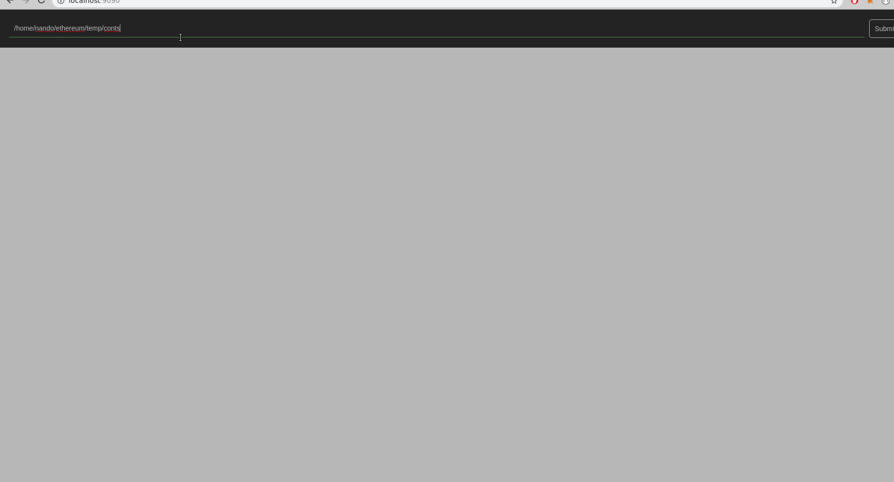

# ethereum-graph-debugger



Graphical EVM debugger. This debugger takes a different approach to traditional debugging. Instead of stepping through the execution of the program, it shows the whole program control flow graph and the actual execution of the transaction highlighted in red. In this way, the developer can see the whole picture and jump where it is necessary in a quick and graphical way.

This project was rewritten with a frontend made by [Swolfeyes](https://github.com/Swolfeyes) and backend by [fergarrui](https://github.com/fergarrui)

[Development repository](https://github.com/fergarrui/ethereum-graph-debugger-ts) was archived, marked as read-only and moved here, to the main repo.

# Existing tools
There are already tools that allow you to debug Ethereum transactions (Solidity):

* [Remix](https://remix.ethereum.org)
* [Truffle](http://truffleframework.com)

# Usage

### Download

Use one of these releases:

  * solc 0.4.24 compatible with ganache use: [v2.2.0](https://github.com/fergarrui/ethereum-graph-debugger/releases/tag/v2.2.0)
  * solc 0.5.8 (not compatible with ganache) use: [v3.0.2](https://github.com/fergarrui/ethereum-graph-debugger/releases/tag/v3.0.2)

If you want to use master (it can be more unstable), clone and start the application

For the first time:
```
  git clone https://github.com/fergarrui/ethereum-graph-debugger.git
  cd ethereum-graph-debugger
  npm install
  npm start
```
Subsequents just:

```
npm start
```

Go to localhost:9090

### Use

  * Go to localhost:9090
  * Enter the path where the contracts are in the input text (it will load Solidity contracts recursively)
  * A tab per file found will be created
  * Under a file tab there are a few actions using the left menu

### How to debug bytecode (with no source code) [Experimental]

  * Create a file with extension `.evm` and paste the runtime bytecode (:warning: important: with `0x` as prefix)
    * For example: create a file named: `contract1.evm` with content `0x60806040`
  * Scan the directory as described above
  * You won't get source code mappings when clicking in operations of the CFG

# Features

  * Now interactive :star2:: it has a sepparate frontend and API instead of building a static HTML file like in earlier versions
  * Control flow graph: the CFG can be built without debugging a transaction.
  * Disassembler: just disassembled opcodes can be seen, from runtime and constructor
  * Source mapping: snippet of code related to the selected instruction is highlighted in the editor left panel
  * Debug transaction: a transaction can be debugged using the contract's CFG and the execution trace
  * Supports contracts calls. All contracts involved in the transaction can be debugged (going to the caller/called tab to see the contract-specific trace)
  * EVM state in transaction: it is shown below the editor when selecting an opcode present in the execution trace of the provided transaction hash
  * Settings: right now, there are settings to point to a different chain (by default it connects to http://127.0.0.1:8545) and basic authentication can be configured, so the RPC endpoint can be accessed if authentication is needed (to be compatible with platforms like [Kaleido](http://kaleido.io))
  * When building the CFG a basic dynamic execution is made to calculate jumps and to remove most of orphan blocks (this will be improved in the future, probably with SymExec)
  * To debug directly bytecode, use `.evm` extension files

# Limitations/Considerations

  * Only Solidity is supported at the moment
  * Only runtime debugging is supported for now (no constructor)
  * You must run it against a node that supports `debug_traceTransaction`, like Geth or Ganache, therefore, Infura is not supported
  * It was rewritten, so new bugs may appear
