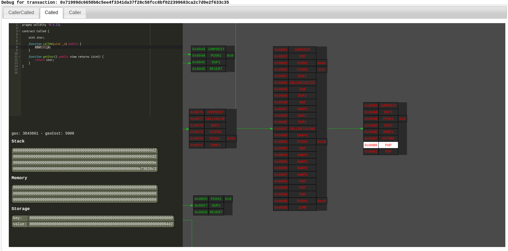

# ethereum-graph-debugger



Graphical Solidity debugger. This debugger takes a different approach to traditional debugging.
Instead of stepping through the execution of the program, it shows the whole program control flow graph and
the actual execution of the transaction highlighted in red. In this way, the developer can see the whole picture
and jump where it is necessary in a quick and graphical way.

# Usage

```
edebugger-<VERSION>.jar <OPTIONS>
Options category 'mandatory':
  --address [-a] (a string; default: "")
    The Address of the contract the transaction is executed against. Cannot be
    set in combination with -f
  --node [-n] (a string; default: "")
    The node where the transaction was run. It must support
    debug_traceTransaction
  --source-file [-f] (a string; default: "")
    The source file of the contract the transaction is executed against. Cannot
    be set in combination with -a
  --transaction-hash [-t] (a string; default: "")
    Transaction hash to debug

Options category 'optional':
  --d3-memory [-m] (a string; default: "537395200")
    D3 graph memory. If the graph is too large, you may want to increase this
    value (by multiplying it)
  --[no]only-trace [-o] (a boolean; default: "false")
    Exclude opcodes that are not executed in the transaction when creating the
    graph. This may help if the graph is too large and the opcodes not executed
    are not important
```

Example:
```
java -jar edebugger-<VERSION>.jar -f ~/tests/Program.sol -n http://127.0.0.1:8545 -t 0x0c971feb820d2bca26c3e7a0a27b5015694d9ec8ea0169935ff7168a63da3f6f
```

# Download

Go to the [releases](https://github.com/fergarrui/ethereum-graph-debugger/releases) section of this repo

# Example debug file

This file is made as a demo to see what this debugger does at this stage. The file can be found here:  [Example debug file](http://htmlpreview.github.com/?https://raw.githubusercontent.com/fergarrui/ethereum-graph-debugger/master/examples/debug.html)

# Existing tools
There are already tools that allow you to debug Ethereum transactions (Solidity):

* [Remix](https://remix.ethereum.org)
* [Truffle](http://truffleframework.com)

# Important note
The bytecode generated by this debugger is compiled **without** compiler optimizations. Make sure to turn it off if you are, for example, using Remix to deploy the contracts. An option should be added anyway to this debugger to support contracts deployed with optimized bytecode.

# Features

* It compiles the provided source code and draws a control flow graph (also imported contracts)
* It supports debugging of transactions even if no source code is provided (option `-a`). It will draw the CFG and trace the transaction
* From the provided transaction hash (using `debug_traceTransaction`) it gets the trace of the transaction
* Combines the control flow graph with the execution trace, highlighting the executed instructions in red
* Supports contracts calls. All contracts involved in the transaction can be debugged
* Instructions opcodes can be clicked in the graph, and the Solidity source code in the left panel involving that instruction is highlighted.
* For the selected opcode, The EVM state is shown (stack, memory, storage, gas, gasCost)

# Limitations

For now there are many limitations since this is a very early release of the debugger

* The control flow graph is drawn from the static bytecode, so there can be nodes without all edges, a symbolic execution would be needed. Maybe will be added in future releases
* Transactions executed in the runtime bytecode are supported (for example, the constructor execution of a contract cannot be debugged right now)
* You must provide a node URL that supports `debug_traceTransaction`, like Geth or Ganache, therefore, Infura is not supported
* It only supports Solidity or bytecode for now, but planning to make it more modular to support different languages (if the compiler gives source mappings)
* The interface is quite ugly, but usable
* Not really a limitation, but the editor syntax highlighting is set to Javascript at the moment
* Probably many more

# Build the project

`mvn clean package` creates a fat executable jar at: `target/edebugger-<version>.jar`

A dependency needs to be in your local maven repository (I want to rewrite that in the future).
The project [Ethereum disassembler](https://github.com/fergarrui/ethereum-disassembler) must be installed using `mvn clean install`.
