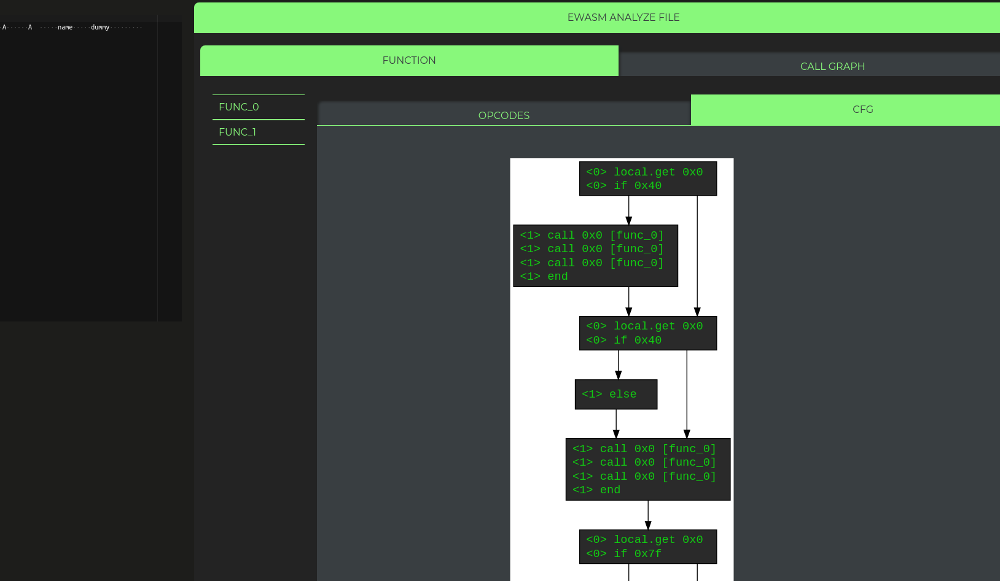
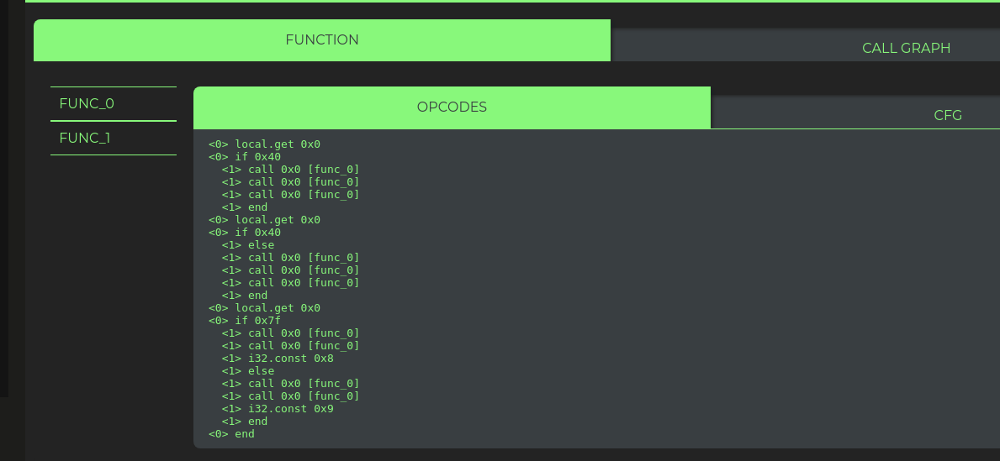
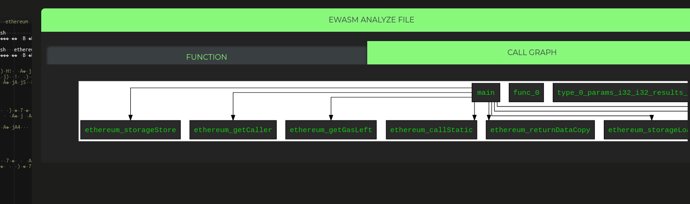

# (e)WASM

If there are `.wasm` files in the provided path they can be analyzed.
For now debugging is not possible.

The analysis will:
* Parse the WASM binary
* Identify WASM binary sections (for now they are not shown, but there will be a 'Summary' section)
* Functions call graph
* Functions are detected, bytecode is disassembled
* Functions control flow graph

### Function call graph

Example of a function CFG:

### Function disassembled bytecode

Example of a function bytecode:

### Wasm module callgraph

Example of a WASM module callgraph

